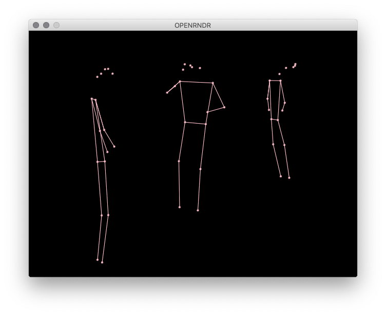
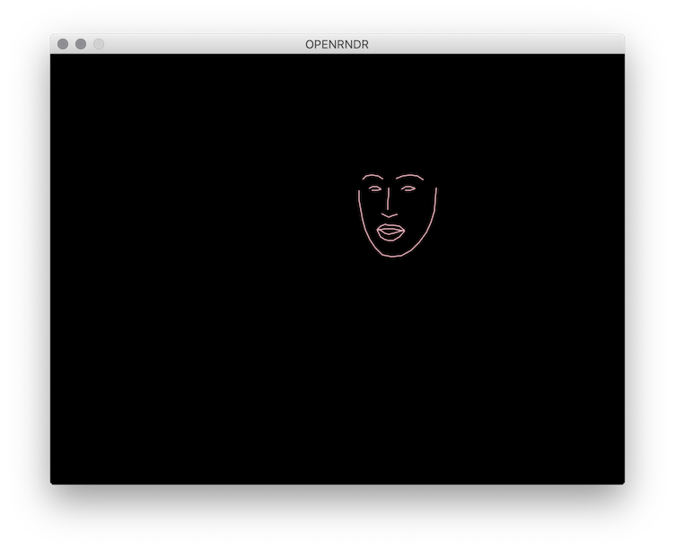

# RunwayML + OpenRNDR

A collection of examples and tutorials on how to use [RunwayML](https://runwayml.com/) with [OpenRNDR](https://openrndr.org/).

More RunwayML networking examples [here](https://learn.runwayml.com/#/networking/examples).

🎉Community Contribution

## Examples

### Socket.IO

* [PoseNet](https://github.com/runwayml/OpenRNDR/blob/master/src/main/kotlin/posenet.kt) by [Ryan Bateman](http://boat.horse/) 🎉 
This is a simple implementation of [OpenRNDR](http://https://openrndr.org) rendering the results outputted by the [PoseNet model](https://github.com/runwayml/processing/blob/master/posenet/posenet.pde). It uses Socket.IO to listen for emitted events and renders the ensuing implemented poses, similar to the [Processing.org implementation](https://github.com/runwayml/processing).

* [Face Detection](https://github.com/runwayml/OpenRNDR/blob/master/src/main/kotlin/facedetect.kt) by [Ryan Bateman](http://boat.horse/) 🎉 
Similiarly, this is a implementation of rendering the results outputted by the [Face Landmarks model](https://github.com/runwayml/processing/blob/master/posenet/posenet.pde), part of Davis E. King's dlib library. It again uses SocketIO to listen for emitted events and renders the faces. 

## Contributing

This is still a work in progress. Contributions welcome!
